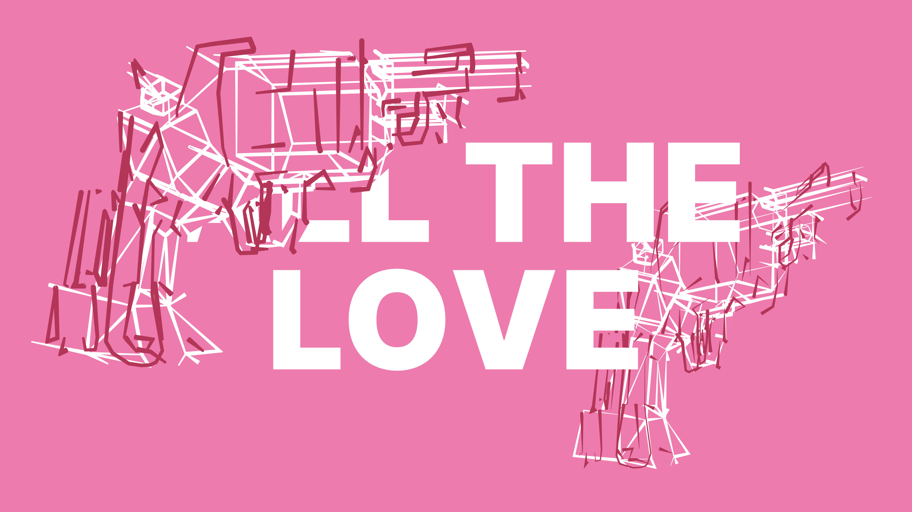

<!-- import YouTubePlayer from '~/components/YouTubePlayer.vue' -->

*All the jagged edges disappear*

*Colors all look brighter when you're near*

*The stars are all afire in the sky*

And the line is obviously taken form the song "All the love in the world" by NIN.  
Oh boy, do I love this song

::YouTubePlayer{videoId="BdzWnFqSMMU" title="All The Love In The World"}
::